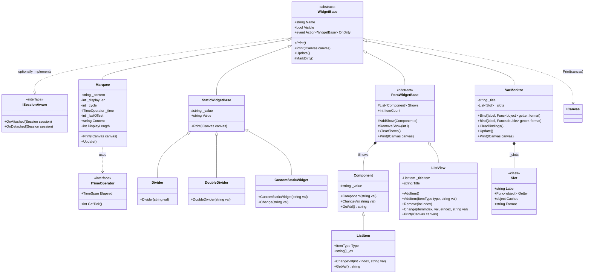
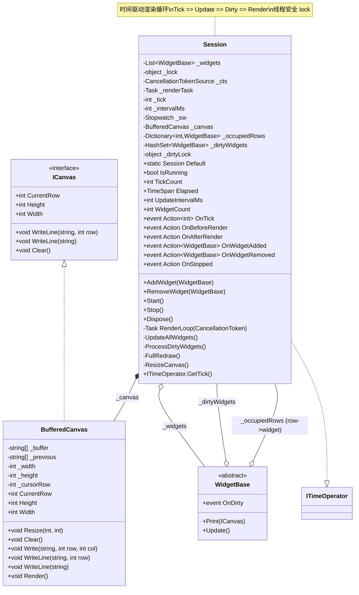
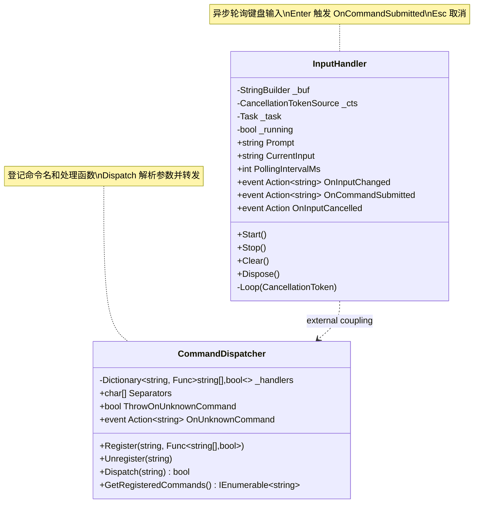
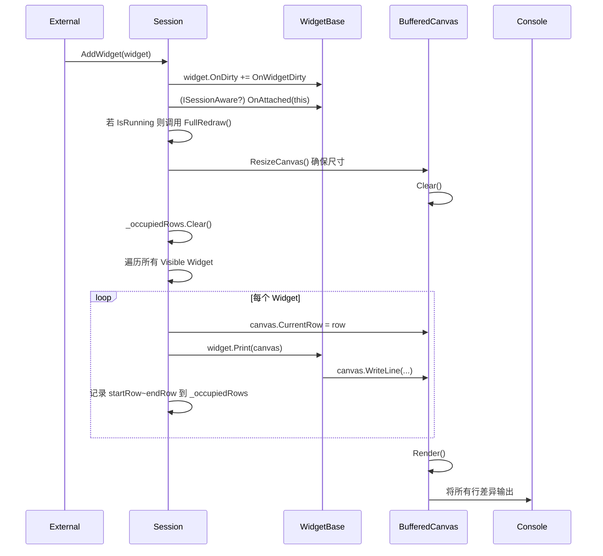
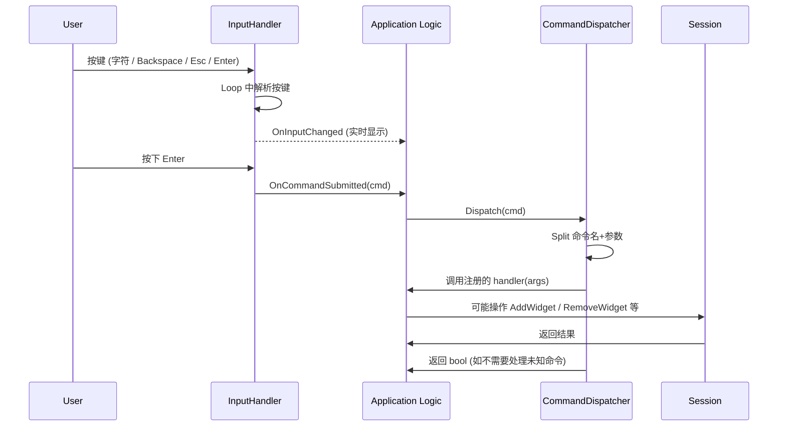

## ConsoleUILib 项目架构设计图与技术栈拆解

### 项目概述
ConsoleUILib 是一个轻量级控制台 UI 框架，提供基于双缓冲的局部刷新渲染循环、控件树管理、变量监控、跑马灯、列表视图、命令分发与异步输入处理等能力。以下将用多幅 Mermaid 图分别展示用例、多组类图、关键时序交互，并完整拆解技术栈。

---

### 1. 用例图
**参与者**：库使用者（开发者）
**用例**：展示框架对外暴露的核心功能

```mermaid
usecaseDiagram
    actor Developer

    Developer --> (Create Session)
    Developer --> (Add Widget)
    Developer --> (Remove Widget)
    Developer --> (Start/Stop Session)
    Developer --> (Start Input Handler)
    Developer --> (Register Command)
    Developer --> (Bind Variable to Monitor)
    Developer --> (Listen to Tick Events)
```

> 用例说明：开发者可创建 `Session` 单例，向其添加各类控件，启动渲染循环，并可选地开启 `InputHandler` 监听键盘，利用 `CommandDispatcher` 注册业务命令，通过 `VarMonitor` 实时监控变量。

---

### 2. 类图（拆解设计）

#### 2.1 Widget 体系类图
展示控件抽象基类、静态控件、段落控件、列表控件、监控控件等继承与组合关系。



**设计要点**：
- `WidgetBase` 是核心抽象，提供脏标记机制和画布输出接口。
- `StaticWidgetBase` 简化静态文本控件，支持值变更自动标记脏区。
- `ParaWidgetBase` 采用组合模式，管理 `Component` 列表，`ListView` 是扩展实现。
- `VarMonitor` 内部用 `Slot` 类缓存变量值，仅在 `Update()` 中检测变化。
- `Marquee` 依赖 `ITimeOperator` 获取 tick 偏移。
- `ISessionAware` 接口让控件在加入/离开 `Session` 时获得通知。

#### 2.2 Session 会话与渲染类图
聚焦 `Session`、`BufferedCanvas`、脏行追踪、渲染循环的协作关系。



**设计要点**：
- `Session` 是核心控制器，单例访问，管理控件集合和渲染循环。
- 双缓冲 `BufferedCanvas` 实现 `ICanvas`，只输出差异行，避免全屏闪烁。
- `_occupiedRows` 建立行号到控件的映射，用于局部重绘时定位控件起始行。
- `_dirtyWidgets` 收集脏控件，`ProcessDirtyWidgets()` 只重绘变更区域，提升性能。
- 渲染循环在后台 `Task` 中运行，通过 `CancellationToken` 安全终止。

#### 2.3 指令与输入系统类图
展示 `InputHandler`、`CommandDispatcher` 以及它们与外部逻辑的耦合方式。



> 这两个类通常由应用程序组合使用：`InputHandler` 收到 `Enter` 时，将字符串交给 `CommandDispatcher.Dispatch()`，执行业务逻辑，业务逻辑可能会操作 `Session` 中的控件。

---

### 3. 时序图

#### 3.1 渲染循环与脏控件局部刷新
```mermaid
sequenceDiagram
    participant Loop as RenderLoop(Task)
    participant Session
    participant W as WidgetBase(s)
    participant Canvas as BufferedCanvas
    participant Console

    Loop ->> Session: while(!cancelled)
    Session ->> W: UpdateAllWidgets() (foreach widget.Update)
    W -->> Session: 值变化时调用 MarkDirty()
    Session ->> Session: ProcessDirtyWidgets()
    loop 对每个脏控件
        Session ->> Session: 从 _occupiedRows 查找控件起始行
        Session ->> Canvas: canvas.CurrentRow = startRow
        Session ->> W: widget.Print(canvas)
        W ->> Canvas: canvas.WriteLine(...)
        Session ->> Canvas: ClearBelow() 清除多余旧行
    end
    Canvas ->> Canvas: Render() 比较 buffer vs previous
    loop 每行
        Canvas ->> Console: 仅当不同时 SetCursorPosition + Write
    end
    Session ->> Session: 触发 OnTick 事件
    Session ->> Loop: await Task.Delay(intervalMs)
```

#### 3.2 添加控件与全量重绘


#### 3.3 命令输入与分发


---

### 4. 技术栈详解

| 层面             | 技术选型与说明                                                                                               |
|------------------|--------------------------------------------------------------------------------------------------------------|
| **语言 / 运行时** | C# 9.0+ / .NET (Core 3.1 或 .NET 6/7/8)，完全跨平台。                                                        |
| **并发与异步**    | `Task` 用于渲染循环和输入监听的后台线程；`CancellationTokenSource` 实现优雅停止；`lock` 保护共享控件集合。        |
| **渲染引擎**      | 自研双缓冲 + 脏标记 + 差异输出：`BufferedCanvas` 持有当前帧与上一帧的字符串数组，`Render()` 只输出变化的行，避免控制台闪烁。 |
| **控件模型**      | 采用组合模式：`WidgetBase` 抽象，派生静态、段落、列表、变量监控等；通过 `Print(ICanvas)` 将内容写入画布，解耦输出与具体设备。 |
| **生命周期**      | `ISessionAware` 接口使控件感知 `Session` 的附加与分离；`IDisposable` 确保 `Session` 和 `InputHandler` 资源释放。 |
| **时间与更新**    | `ITimeOperator.GetTick()` 提供全局 tick 计数，`Marquee` 等控件据此计算动画偏移；`Update()` 在每个 tick 被调用，控件内部检测变化并标记脏区。 |
| **事件机制**      | 大量使用 `Action<T>` / `event`：`OnDirty`, `OnTick`, `OnWidgetAdded`, `OnCommandSubmitted` 等，实现松耦合通知。 |
| **命令系统**      | `CommandDispatcher` 基于字符串协议，支持自定义分隔符，与 `InputHandler` 配合可快速构建交互式控制台应用。       |
| **变量监控**      | `VarMonitor` 通过泛型 `Func<object>` 绑定外部变量，在 `Update()` 中对比缓存值，实现零开销的实时监视。           |
| **性能优化**      | 局部重绘：仅对标记为脏的控件重新调用 `Print`，并根据行映射清理残留行；控件错误被捕获忽略，保证渲染循环稳定。    |

---

以上设计图与技术栈分析完整覆盖了项目架构，可据此快速理解各模块职责与协作方式。
